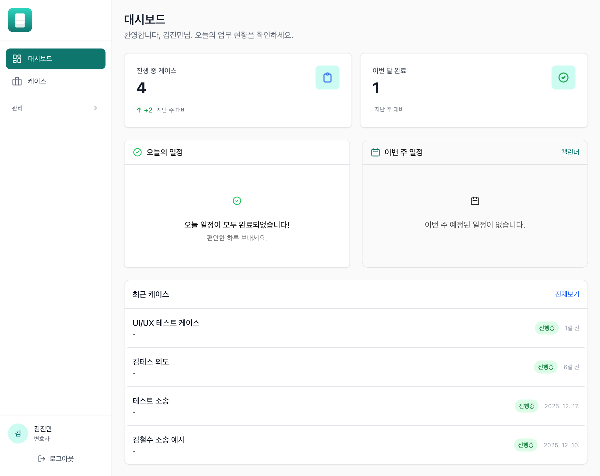
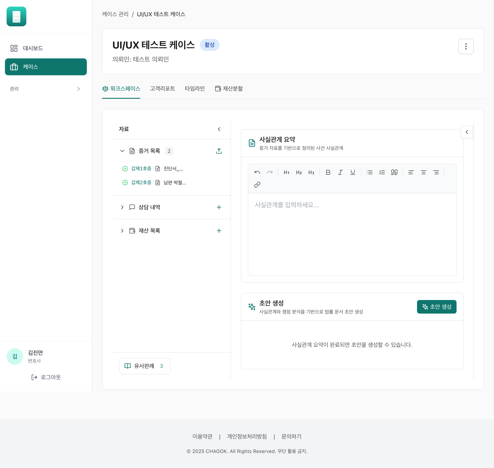
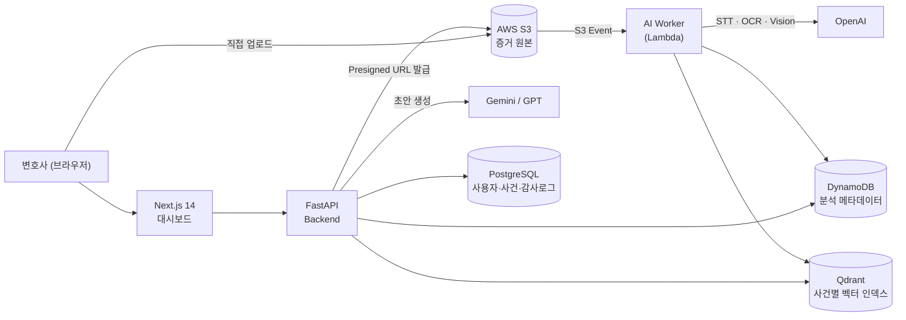

# CHAGOK (차곡) — Legal Evidence Hub

[](https://github.com/leaf446/legal_ai_agent/actions/workflows/ci.yml)

> **이혼 사건 전용 AI 파라리걸 & 증거 허브**
> 변호사는 사건을 생성하고 증거를 올리기만 하면, AI가 AWS 안에서 증거를 정리·분석해 소장 초안 후보를 제안합니다. 최종 문서는 언제나 변호사가 직접 결정합니다.

**Tests:** Backend 1,700 passed (cov 76%) · AI Worker 1,025 passed (cov 79%) · Frontend 112 test suites passed

---

## 🎬 데모

[](https://youtu.be/UPJp2eQVH8A)

> **[▶ 시연 영상 보기 (YouTube)](https://youtu.be/UPJp2eQVH8A)** — 증거 업로드부터 AI 분석, 소장 초안 생성까지 전체 파이프라인 시연

| 변호사 대시보드 | 케이스 워크스페이스 (사실관계 요약 → 초안 생성) |
|:---:|:---:|
|  |  |

---

## 1. 프로젝트 개요

법률 사무소에서 이혼 사건 증거는 카톡 캡처, 녹음 파일, 영상, PDF 등으로 **중구난방으로 도착**하고, 수작업 정리에 1~2주가 걸립니다. CHAGOK은 이 과정을 자동화합니다.

| 기존 문제 | CHAGOK 솔루션 |
|-----------|-----------|
| 카톡/이메일/USB로 흩어진 증거 | S3 Presigned URL 직접 업로드 |
| 수작업 정리 1~2주 소요 | S3 이벤트 기반 AI 자동 분석 파이프라인 |
| 중요 증거 누락·오용 리스크 | 구조화된 타임라인, 인물관계도, 필터 |
| 증거 무결성(Chain of Custody) 부담 | SHA-256 해시 + 불변 Audit Log |
| 소장 초안 작성 부담 | 사실관계 요약 기반 초안 자동 생성 (Preview Only) |

**설계 원칙**
- 모든 증거는 **단일 AWS 계정 내부**에서만 저장·처리 (외부 스토리지 없음)
- 사건별 RAG 인덱스 격리 (`case_rag_{case_id}`) — 사건 간 데이터 유출 원천 차단
- AI 산출물은 **Preview Only** — 자동 제출 없음, 변호사가 항상 최종 결정

## 2. 아키텍처



**증거 처리 흐름**: 업로드(S3) → Lambda 자동 트리거 → 파일 타입별 파서(카톡 텍스트/이미지/음성/영상/PDF) → 요약·민법 840조 사유 태깅·화자 분리 → DynamoDB/Qdrant 저장 → 타임라인·검색·사실관계 요약·초안 생성에 활용

## 3. 기술 스택

| 영역 | 기술 |
|:-----|:-----|
| Frontend | Next.js 14, TypeScript, Tailwind CSS, React Flow (인물관계도) |
| Backend | FastAPI, SQLAlchemy, Pydantic — Router → Service → Repository 계층 구조 |
| AI Worker | AWS Lambda, 파일 타입별 파서 (Strategy Pattern) |
| AI/LLM | OpenAI (Whisper STT, Vision, Embedding), Gemini (초안 생성) |
| 저장소 | S3 (증거 원본), DynamoDB (분석 결과), Qdrant (벡터), PostgreSQL/SQLite (RDB) |
| 인증/보안 | JWT (HTTP-only Cookie), RBAC, 사건별 권한, SHA-256 무결성 검증 |
| CI/CD | GitHub Actions — 3개 티어 lint/test/build + Playwright E2E |

## 4. 팀 구성 & 역할

KernelAcademy AI Camp 2기 팀 프로젝트 (3인, 2025.11 ~ 2025.12)

| 역할 | GitHub | 담당 |
|:-----|:-------|:-----|
| **Backend / Infra** | [leaf446](https://github.com/leaf446) *(+ tae yeon 계정, 이 저장소 소유자)* | FastAPI 전체 API 설계·구현, JWT/RBAC 인증, 사건·증거·초안 생성 서비스, RAG 검색 연동, 증거 무결성(SHA-256·Audit Log), DB 모델링·마이그레이션 |
| AI / Data | [vsun410](https://github.com/vsun410) | AI Worker(Lambda), STT/OCR/Vision 파서, 요약·840조 태깅, 임베딩·RAG 파이프라인 |
| Frontend / PM | [Prometheus-P](https://github.com/Prometheus-P) *(+ HSP 계정)* | Next.js 대시보드, UX, GitHub 운영, PR 승인 |

## 5. 로컬에서 실행해보기 (API 키 불필요)

외부 API 키 없이 **UI 전체를 탐색**할 수 있습니다 (SQLite 사용). 증거 AI 분석·초안 생성 등 AI 기능은 OpenAI/AWS 키가 필요하며, 전체 파이프라인 동작은 위 데모 영상에서 확인할 수 있습니다.

**사전 요구사항**: Python 3.11+, Node.js 18+

```bash
git clone https://github.com/leaf446/legal_ai_agent.git
cd legal_ai_agent
```

**1) Backend** (터미널 1)

```bash
cd backend
python -m venv .venv
# Windows: .venv\Scripts\activate | macOS/Linux: source .venv/bin/activate
pip install -r requirements.txt
cd ..

# 로컬 실행 (SQLite + 더미 키 자동 설정)
# Windows PowerShell:
.\scripts\run-local-backend.ps1
# macOS/Linux:
bash scripts/run-local-backend.sh
```

**2) Frontend** (터미널 2)

```bash
cd frontend
npm install
npm run dev
```

http://localhost:3000 접속 → 회원가입 후 바로 사용 (API 문서: http://localhost:8000/docs)

**테스트 실행**

```bash
cd backend  && pytest -m "not integration"   # 1,700 passed
cd ai_worker && pytest -m "not integration"  # 1,025 passed
cd frontend && npm test                      # 112 suites passed
```

> ⚠️ Windows에서 backend 테스트 시 PDF 생성 테스트는 WeasyPrint의 GTK 시스템 의존성으로 제외 필요: `pytest -m "not integration" --ignore=tests/unit/test_pdf_generator.py`

**전체 기능 실행** (AI 파이프라인 포함): `.env.example`을 참고해 OpenAI API 키, AWS 자격증명(S3·DynamoDB), Qdrant(로컬 Docker 가능), Gemini API 키(선택 — 없으면 OpenAI로 폴백)를 설정하세요.

## 6. 레포 구조

```
├── backend/              # FastAPI 백엔드
│   └── app/
│       ├── api/          # 라우터 (auth, cases, evidence, drafts, ...)
│       ├── services/     # 비즈니스 로직 (초안 생성, 사실관계 요약, 판례 검색, ...)
│       ├── repositories/ # 데이터 접근 계층
│       ├── middleware/   # 보안 헤더, 에러 핸들링, 감사 로그
│       └── utils/        # S3 · DynamoDB · Qdrant · OpenAI/Gemini 어댑터
├── ai_worker/            # AI Lambda 워커
│   ├── handler.py        # S3 이벤트 엔트리포인트
│   └── src/
│       ├── parsers/      # 카톡/이미지/음성/영상/PDF 파서
│       ├── analysis/     # 요약, 840조 태깅, 증거 스코어링
│       └── storage/      # DynamoDB, Qdrant 저장소
├── frontend/             # Next.js 대시보드
├── docs/                 # PRD, 아키텍처, API 명세 등 설계 문서
└── specs/                # 기능별 스펙 문서 (spec-driven development)
```

## 7. 문서 허브

| 카테고리 | 문서 |
|----------|------|
| 제품 요구사항 | [docs/specs/PRD.md](docs/specs/PRD.md) |
| 시스템 아키텍처 | [docs/specs/ARCHITECTURE.md](docs/specs/ARCHITECTURE.md) |
| API 명세 | [docs/specs/API_SPEC.md](docs/specs/API_SPEC.md) |
| 환경 설정 | [docs/ENVIRONMENT.md](docs/ENVIRONMENT.md) |
| 협업 규칙 | [docs/CONTRIBUTING.md](docs/CONTRIBUTING.md) |

## 8. 법률·보안 고려사항

- **No Auto-Submit**: AI 산출물은 Preview 전용 — 변호사 검토·수정 필수
- **증거 무결성**: 업로드 시 SHA-256 해시, Chain of Custody, 불변 감사 로그
- **사건 격리**: 사건별 RAG 인덱스 분리, 사건 종결 시 벡터 컬렉션 삭제
- **개인정보**: 사건 종결 시 소프트 삭제, PIPA/변호사법 대응 설계
